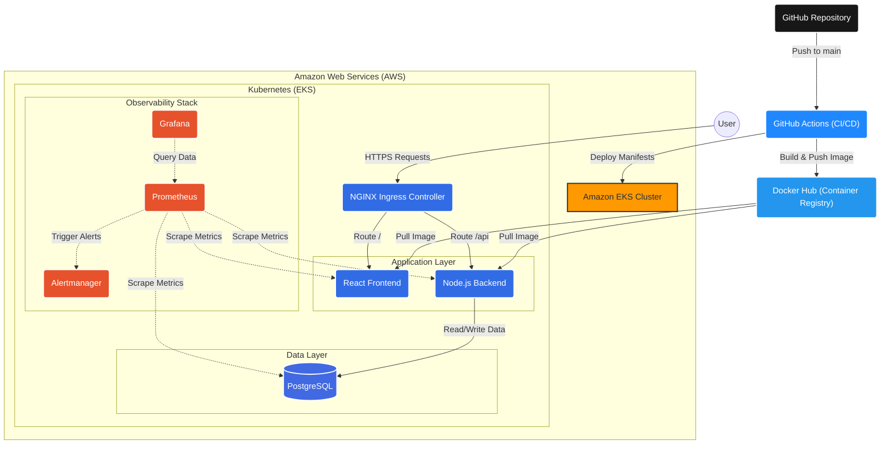

# Architecture

The following diagram illustrates the architecture of the Cloud Native DevOps Platform, covering the software delivery lifecycle from source code commit to production deployment, as well as runtime cluster architecture.

## Description
1. **GitHub** acts as the single source of truth for application code and infrastructure configuration.
2. **GitHub Actions** automates the building of Docker images, testing, and deployment to the Kubernetes cluster.
3. **Docker Hub** serves as the container registry storing production-ready artifacts.
4. **Amazon EKS** provides a highly scalable managed Kubernetes control plane.
5. **NGINX Ingress** handles external user traffic, performing TLS termination and routing to the appropriate microservice.
6. **Frontend & Backend** microservices are dynamically scaled via HPA (Horizontal Pod Autoscaling).
7. **PostgreSQL** maintains state using Persistent Volume Claims mapped to AWS EBS.
8. **Prometheus, Grafana, & Alertmanager** constantly monitor cluster health and alert operators in the event of anomalies.
